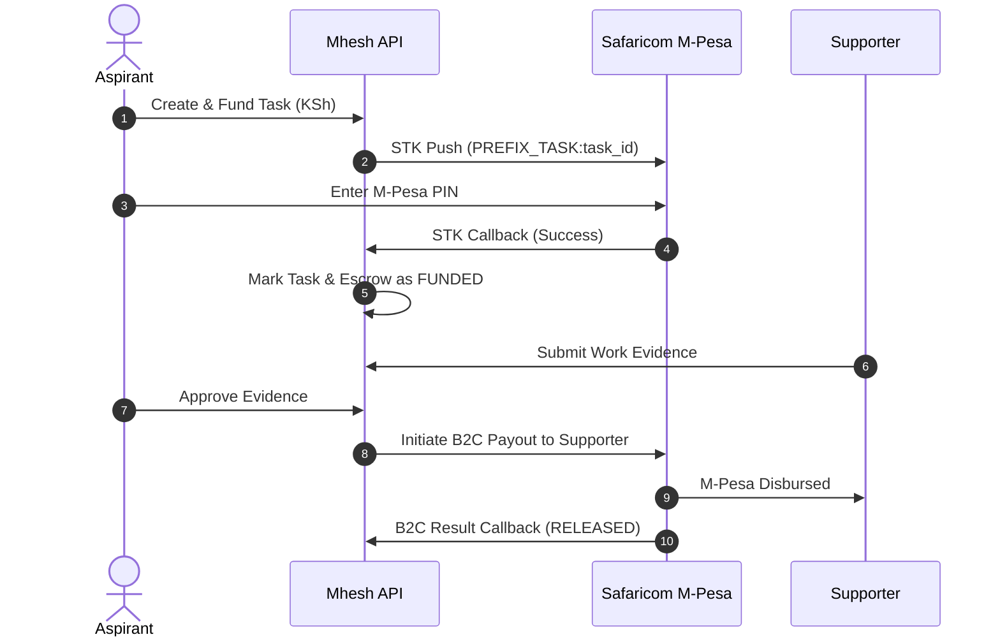
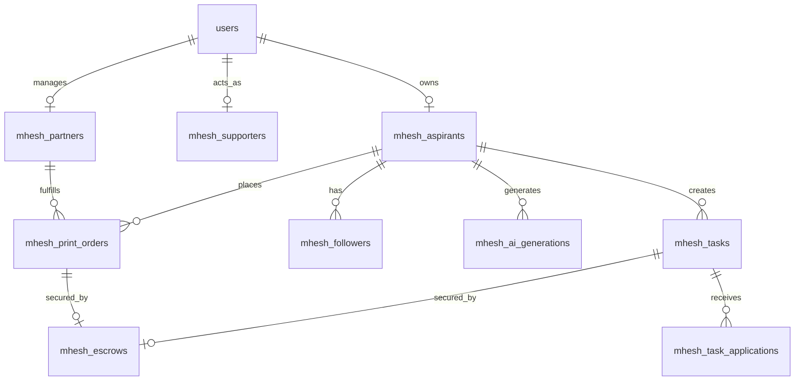

# Mhesh Architecture & Technical Design

This document details the architectural principles, component interactions, and multi-tenant design of **Mhesh** within the **Mafichoni Stack**.

---

## 1. Multi-Tenant Integration (Mafichoni Stack)

Mhesh operates as an additive, isolated tenant in the broader Mafichoni ecosystem:
- **Shared Core Services**:
  - `User` model (`backend/app/models.py`) and JWT authentication.
  - M-Pesa Daraja payment callbacks (`/api/payments/mpesa/callback`).
  - Cloudflare R2 storage services (`backend/app/services/storage.py`).
  - WhatsApp Cloud API messaging client (`backend/app/services/whatsapp.py`).
- **Mhesh-Specific Layers**:
  - Dedicated relational data models prefixed with `Mhesh*` in `backend/app/mhesh_models.py`.
  - Prefix routing under `/api/mhesh/*`.
  - Isolated frontend route space under `/app/mhesh/*`.
  - Independent compliance and statutory blackout middleware.

---

## 2. Core Subsystems

### 2.1 Identity & Access Management (IAM)
- **Authentication**: JWT bearer tokens generated with HS256 and subject set to user UUID.
- **Role & Persona Resolution**:
  - Users authenticate via email or Kenyan phone (`+254...` or `07...`).
  - Candidates link a `mhesh_aspirants` record to `users.id`.
  - Supporters link a `mhesh_supporters` record.
  - Print partners link a `mhesh_partners` record.
  - Platform administrators are verified against `ADMIN_EMAILS` (default: `wainaina.mungai@gmail.com`).

### 2.2 Escrow & Payment Engine
Mhesh is non-custodial and acts as a payment facilitation platform:

- **M-Pesa STK Push Prefixes**:
  - `TASK_{task_id}`: Task reward escrow funding.
  - `PRINT_{order_id}`: Merchandise print order funding.
  - `SUB_{user_id}_{tier}`: Candidate subscription tier (Verified, Featured).
  - `VERIFY_{user_id}`: Candidate M-Pesa phone verification fee (KSh 1).
- **M-Pesa B2C Disbursements**:
  - Automated payout when a candidate approves task evidence or print order delivery.
  - Deducts platform/referral fee and transmits remaining reward directly to supporter's registered phone.

### 2.3 AI Campaign Studio & Model Pipeline
1. **LoRA Fine-Tuning**:
   - Aspirants upload 5–10 reference photos via Cloudflare R2 presigned URLs.
   - Training job dispatched to Wan 2.2 / SDXL GPU worker with subject trigger token.
   - Model weights saved to R2 with dedicated key `lora_key`.
2. **Generation Pipeline**:
   - Prompt moderation scans for defamation, hate speech, or depictions of third parties.
   - Diffusion model renders image incorporating candidate's face-preserving weights and chosen template (e.g. *Rally Podium*, *Market Visit*, *Formal Portrait*).
   - EXIF metadata is injected with model parameters, timestamp, and audit key.
   - Visible `<AiGeneratedTag />` watermark applied on public preview and export.
   - Generation record logged to `mhesh_ai_generations`.

### 2.4 Trust & Verification Engine
Candidates and partners accumulate a dynamic **Trust Score** (0–100):
- **Candidate Trust Score Formula**:
  - `+30`: M-Pesa identity verified.
  - `+25`: Manifesto published (min 3 items).
  - `+15`: Official name & ID registered.
  - `+15`: Campaign tasks completed and paid out without disputes.
  - `+15`: Profile photo uploaded and verified.
- Recomputed on relevant lifecycle events and audited periodically by `mhesh_cron.py`.

---

## 3. Database Entity Relationship Diagram

---

## 4. Background Workers & Scheduled Jobs

Implemented in `backend/app/workers/mhesh_cron.py`:
- **Blackout Daemon**: Executes periodically to verify current time against `MHESH_BLACKOUT_START`. If active, automatically rejects task publications and new public profiles.
- **Trust Score Recomputation**: Nightly recalculation of trust scores based on completed milestones, dispute ratios, and verified escrow transactions.
- **Featured Expiry**: Downgrades expired candidate tier subscriptions from `featured` to `verified` or `free`.
